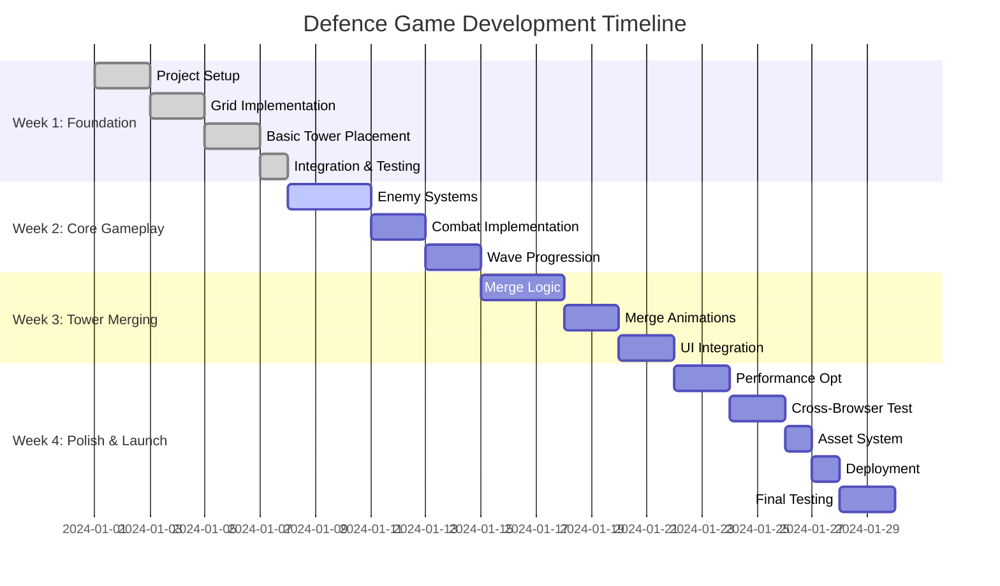

# Defence Game Development Plan

## Table of Contents
- [Project Overview](#project-overview)
- [Technical Architecture](#technical-architecture)
- [Implementation Roadmap](#implementation-roadmap)
- [Team Collaboration Strategy](#team-collaboration-strategy)
- [Asset Management](#asset-management)
- [Deployment Strategy](#deployment-strategy)
- [Risk Assessment](#risk-assessment)
- [Quality Assurance](#quality-assurance)
- [Timeline & Milestones](#timeline--milestones)

---

## Project Overview

### Game Concept
A tower defense game with sophisticated level progression, economy system, and tower merging mechanics, deployed as a web application for desktop browsers.

### Core Features
- Progressive wave-based enemy system with 6+ enemy types (Basic, Tank, Flying, Boss, Swarm, Armored)
- Complex economy system with gold rewards and strategic spending
- Tower merging system (3 levels: Basic → Advanced → Elite)
- Grid-based tower placement (5x9 cells)
- Level progression with difficulty scaling (1.0 + Level × 0.15 multiplier)
- Drag-and-drop interface with visual feedback
- Real-time combat with projectiles and enemy behaviors
- Achievement and progression tracking
- Multiple enemy archetypes requiring different strategies

### Technical Requirements
- **Platform**: Web browser (desktop)
- **Performance**: 60 FPS target
- **Technology**: Phaser.js + React + TypeScript
- **Deployment**: Netlify (static hosting)
- **Timeline**: 30 days development cycle

### Success Criteria
- Fully playable demo by Day 20
- Complete tower merging system
- Cross-browser compatibility
- Deployable on Netlify
- Asset system allowing easy visual updates

---

## Technical Architecture

### Technology Stack

| Component | Technology | Version | Purpose |
|-----------|------------|---------|---------|
| Game Engine | Phaser.js | 3.80+ | 2D rendering, physics, input handling |
| UI Framework | React | 18+ | Component-based user interface |
| Language | TypeScript | Latest | Type safety and developer experience |
| Build Tool | Vite | Latest | Fast development and optimized builds |
| State Management | Zustand | Latest | Lightweight game state management |
| Styling | Tailwind CSS | Latest | Utility-first CSS framework |
| Audio | Howler.js | Latest | Cross-platform audio management |
| Testing | Vitest | Latest | Unit and integration testing |
| Deployment | Netlify | Free tier | Static site hosting and CI/CD |

### System Architecture

```
┌─────────────────┐    ┌─────────────────┐    ┌─────────────────┐
│   React UI      │    │   EventBus      │    │  Phaser Engine  │
│                 │    │                 │    │                 │
│ • Tower Panel   │◄──►│ • Communication │◄──►│ • Game Scene    │
│ • Game Stats    │    │ • Event Handling│    │ • Entity System│
│ • Merge UI      │    │ • State Sync    │    │ • Physics       │
└─────────────────┘    └─────────────────┘    └─────────────────┘
```

### Performance Requirements (From PRD)

#### Technical Performance Targets
- **Frame Rate**: 60 FPS during intense combat with 100+ enemies
- **Level Loading**: < 100ms loading times between levels
- **Memory Usage**: Efficient entity pooling to handle 100+ enemies per wave
- **Responsive UI**: < 16ms response time for user interactions

#### Entity Management Limits
- **Maximum Enemies**: 100+ enemies per wave (per PRD requirement)
- **Maximum Projectiles**: 50 active projectiles simultaneously
- **Entity Pooling**: Pre-allocated pools to prevent garbage collection
- **Spatial Partitioning**: Grid-based collision detection for performance

#### Browser Compatibility
- **Target Browsers**: Chrome, Firefox, Safari, Edge (latest versions)
- **WebGL Support**: Required for 60 FPS with multiple entities
- **Memory Requirements**: 4GB RAM minimum for smooth performance
- **Storage Requirements**: 500MB for save files and level data

#### Quality Metrics (From PRD KPIs)
- **Level Completion Rate**: > 70% target
- **Player Retention**: > 60% for first 10 levels
- **Session Duration**: Average 15-20 minutes
- **Economy Balance**: < 20% variance in player spending patterns

### Project Structure

```
defence-game/
├── src/
│   ├── scenes/              # Phaser scenes
│   │   ├── GameScene.ts         # Main game world
│   │   └── UIScene.ts           # UI overlay
│   ├── entities/            # Game objects
│   │   ├── Tower.ts              # Tower with merge logic
│   │   ├── Enemy.ts              # Enemy pathfinding
│   │   └── Projectile.ts         # Combat projectiles
│   ├── systems/             # Game logic systems
│   │   ├── TowerSystem.ts        # Placement & merging
│   │   ├── EnemySystem.ts        # Spawning & AI
│   │   ├── CombatSystem.ts       # Damage & collisions
│   │   └── WaveSystem.ts         # Level progression
│   ├── components/          # ECS components
│   │   ├── Position.ts
│   │   ├── Health.ts
│   │   ├── Attack.ts
│   │   └── Mergeable.ts
│   ├── types/               # TypeScript definitions
│   │   ├── GameState.ts
│   │   └── TowerTypes.ts
│   ├── utils/               # Shared utilities
│   │   ├── EventBus.ts           # React-Phaser communication
│   │   └── AssetLoader.ts        # Asset management
│   ├── config/              # Game configuration
│   │   ├── GameConfig.ts          # Balance settings
│   │   └── MergeRules.ts          # Tower merge combinations
│   ├── hooks/               # React hooks
│   │   ├── useGameState.ts
│   │   └── useTowerPlacement.ts
│   └── components/          # React UI components
│       ├── GameUI.tsx            # Main interface
│       ├── TowerPanel.tsx        # Tower selection
│       └── WaveInfo.tsx          # Wave progress
├── public/assets/              # Easy-to-replace assets
│   ├── towers/                 # Tower sprites
│   ├── enemies/                # Enemy sprites  
│   ├── ui/                     # UI elements
│   └── sounds/                 # Audio files
└── docs/                       # Documentation
```

### Core Systems Design

#### Level Progression System (Based on PRD)
- **Difficulty Scaling**: `1.0 + (Level × 0.15)` multiplier for enemy stats
- **Enemy Health**: `BaseHealth × LevelDifficulty`
- **Enemy Speed**: `BaseSpeed × (1 + Level × 0.05)`
- **Reward Multiplier**: `1.0 + (Level × 0.1)`
- **Wave Structure**: Progressive enemy count (5-50 enemies per wave)
- **Level Completion Bonus**: 100-500 gold scaling with level

#### Enemy System (6 Types)
- **Basic Enemy**: Low health (100), high speed (1.5x), low reward (10g)
- **Tank Enemy**: High health (300), slow speed (0.8x), medium reward (25g)
- **Flying Enemy**: Medium health (150), high speed (2.0x), high reward (20g)
- **Boss Enemy**: Very high health (1000), medium speed (1.0x), very high reward (100g)
- **Swarm Enemy**: Low health (50), high speed (1.8x), medium reward (15g)
- **Armored Enemy**: Medium health (200), slow speed (0.9x), high reward (30g)

#### Economy System (Based on PRD)
- **Starting Money**: 200 gold
- **Tower Cost Range**: 50-500 gold
- **Reward Calculation**: `BaseReward × RewardMultiplier × DifficultyModifier`
- **Spending Options**: Tower purchases, tower upgrades, special abilities
- **Balance Points**: 70-85% of players can afford needed upgrades

#### Tower Merging System
- **Merge Detection**: Adjacent cell checking for identical tower types
- **Level Progression**: 3-tier system (Basic → Advanced → Elite)
- **Cost Structure**: Merge cost = sum of individual costs × 1.5
- **Visual Feedback**: Glow effects and particle animations

#### Entity-Component-System (ECS)
- **Components**: Position, Health, Attack, Mergeable, EnemyType
- **Systems**: TowerSystem, EnemySystem, CombatSystem, LevelManager, EconomyManager
- **Entities**: Towers, Enemies, Projectiles, Currency pickups

#### Event-Driven Architecture
- **EventBus**: Central communication hub between React and Phaser
- **Game Events**: towerPlaced, towerMerged, enemySpawned, waveCompleted, enemyKilled
- **UI Events**: towerSelected, mergeInitiated, gamePaused, levelStarted
- **Economy Events**: moneyEarned, moneySpent, levelCompleted, waveCompleted

---

## Implementation Roadmap

### Week 1: Foundation Setup (Days 1-7)

#### Objectives
Establish project foundation with working game loop, basic tower placement, economy system, and level progression framework.

#### Deliverables
- ✅ Project initialized with Vite + React + TypeScript
- ✅ Phaser integration with WebGL rendering
- ✅ 5x9 grid system implementation
- ✅ Basic tower placement mechanics with cost validation
- ✅ EventBus communication system
- ✅ React UI structure with tower selection panel
- ✅ EconomyManager with gold tracking (starting 200 gold)
- ✅ Basic LevelManager with sequential progression framework
- ✅ Enemy type definitions (Basic, Tank, Flying, Boss)

#### Technical Milestones

| Day | Tasks | Owner | Dependencies |
|-----|-------|-------|-------------|
| 1-2 | Project setup, Vite config, dependencies | Both | None |
| 3-4 | GameScene with grid rendering, basic Tower entity | Person 1 | Project setup |
| 5-6 | React UI components, EventBus implementation | Person 2 | Project setup |
| 7 | Integration: tower placement from UI to game | Both | All previous tasks |

#### Acceptance Criteria
- Grid renders correctly with 5x9 cell layout
- Towers can be placed via drag-and-drop from UI panel
- React and Phaser communicate through EventBus
- Basic asset loading system in place

#### Risk Areas & Mitigation
- **Phaser-React Integration**: Use proven EventBus pattern
- **Grid positioning**: Use fixed cell coordinates (80px each)
- **Asset loading**: Implement fallback to colored rectangles

---

### Week 2: Core Gameplay (Days 8-14)

#### Objectives
Implement complete game loop with multiple enemy types, combat, wave progression, and balanced economy system.

#### Deliverables
- ✅ Enemy entities with unique behaviors (Basic, Tank, Flying, Boss)
- ✅ Combat system with projectiles and damage calculation
- ✅ Wave spawning with difficulty scaling (1.0 + Level × 0.15)
- ✅ Economy integration with gold rewards (Basic: 10g, Tank: 25g, Flying: 20g, Boss: 100g)
- ✅ Level progression system with wave breaks and completion bonuses
- ✅ Collision detection and damage system with enemy health/armor
- ✅ Game state management (win/lose conditions with gold rewards)
- ✅ Basic audio integration for rewards and combat

#### Technical Milestones

| Day | Tasks | Owner | Dependencies |
|-----|-------|-------|-------------|
| 8-10 | Enemy entity, basic pathfinding, EnemySystem | Person 1 | Week 1 foundation |
| 11-12 | Combat system, projectiles, collision detection | Person 1 | Enemy entity |
| 13-14 | Wave progression, game states, state management | Person 2 | Combat system |
| 14 | Integration: complete game loop | Both | All systems complete |

#### Acceptance Criteria
- Enemies spawn and follow path from right to left
- Towers attack enemies with projectiles
- Collision detection works correctly
- Wave progression increases difficulty
- Win/lose conditions trigger appropriate game states

#### Risk Areas & Mitigation
- **Pathfinding complexity**: Start with simple linear movement
- **Performance**: Implement object pooling for projectiles
- **State management**: Use Zustand for predictable updates

---

### Week 3: Tower Merging System (Days 15-21)

#### Objectives
Implement complete tower merging mechanics with visual feedback and animations.

#### Deliverables
- ✅ Merge detection algorithm
- ✅ Tower upgrade logic and stat progression
- ✅ Drag-and-drop merging interface
- ✅ Visual feedback and merge animations
- ✅ Merge UI highlights and indicators
- ✅ Three-tier tower progression system

#### Technical Milestones

| Day | Tasks | Owner | Dependencies |
|-----|-------|-------|-------------|
| 15-17 | Merge detection logic, tower upgrade system | Person 1 | Core gameplay |
| 18-19 | Merge animations, particle effects, visual feedback | Person 1 | Merge logic |
| 20-21 | Merge UI, highlights, user feedback integration | Person 2 | Merge animations |
| 21 | Integration: complete merging experience | Both | All merge components |

#### Acceptance Criteria
- Identical adjacent towers can be merged via drag-and-drop
- Tower levels progress correctly (Basic → Advanced → Elite)
- Merge animations play smoothly
- UI clearly indicates mergeable towers
- Tower stats scale appropriately with level upgrades

#### Risk Areas & Mitigation
- **Merge detection**: Use grid adjacency checking, limit to immediate neighbors
- **Animation performance**: Use Phaser tweens, limit particle count
- **UI feedback**: Clear visual indicators, hover states

---

### Week 4: Polish & Deployment (Days 22-30)

#### Objectives
Complete polish, optimization, testing, and deployment of the game.

#### Deliverables
- ✅ Performance optimization (60 FPS target)
- ✅ Cross-browser compatibility testing
- ✅ UI polish and animations
- ✅ Asset replacement system
- ✅ Netlify deployment configuration
- ✅ Documentation and README

#### Technical Milestones

| Day | Tasks | Owner | Dependencies |
|-----|-------|-------|-------------|
| 22-23 | Performance optimization, entity limits, LOD system | Person 1 | Complete game |
| 24-25 | UI polish, animations, sound effects | Person 2 | Optimized game |
| 26-27 | Cross-browser testing, bug fixes, balance tuning | Both | Polished game |
| 28-29 | Asset replacement system, documentation | Person 2 | Tested game |
| 30 | Netlify deployment, final testing | Both | Complete game |

#### Acceptance Criteria
- Game maintains 60 FPS on target browsers
- Works correctly on Chrome, Firefox, Safari, Edge
- Assets can be easily replaced without code changes
- Game is deployed and accessible via Netlify URL
- Documentation covers setup, development, and deployment

#### Risk Areas & Mitigation
- **Performance**: Entity pooling, LOD systems, profiling tools
- **Browser compatibility**: Test early, use polyfills if needed
- **Deployment**: Test Netlify configuration locally first

---

## Team Collaboration Strategy

### Team Composition

| Role | Person | Primary Responsibilities |
|------|--------|--------------------------|
| Game Systems Developer | Person 1 | Core game logic, entities, physics, performance |
| UI/Integration Developer | Person 2 | React components, state management, assets, deployment |

### Development Workflow

#### Parallel Development Strategy

**Week 1**: Foundation Setup
- **Person 1**: GameScene, grid rendering, Tower entity
- **Person 2**: React setup, EventBus, UI components
- **Integration**: Tower placement communication

**Week 2**: Core Gameplay  
- **Person 1**: Enemy systems, combat, projectiles
- **Person 2**: State management, game logic UI, audio
- **Integration**: Complete game loop functionality

**Week 3**: Tower Merging
- **Person 1**: Merge logic, animations, tower upgrades
- **Person 2**: Merge UI, visual feedback, user experience
- **Integration**: Seamless merge workflow

**Week 4**: Polish & Deployment
- **Person 1**: Performance optimization, bug fixes
- **Person 2**: UI polish, asset system, deployment
- **Integration**: Final testing and launch preparation

#### Communication & Coordination

**Daily Standups** (15 minutes)
- Yesterday's accomplishments
- Today's priorities
- Blockers and dependencies

**Weekly Integration** (Fridays)
- Full system testing
- Cross-feature compatibility
- Planning adjustments

**Code Review Process**
- All changes reviewed before merge
- Focus on integration points
- Performance impact assessment

#### Integration Points & Dependencies

**Critical Integration Points**:
1. **EventBus Communication** (Day 3-4)
2. **Tower Placement** (Day 7)
3. **Game Loop Completion** (Day 14)
4. **Merge System Integration** (Day 21)
5. **Final Deployment** (Day 30)

**Dependency Management**:
- Use feature branches for parallel development
- Integration branch for weekly merges
- Main branch reflects production-ready state

#### Tooling & Processes

**Development Environment**:
- Local development with Vite HMR
- Shared TypeScript configurations
- Consistent code formatting (Prettier)
- ESLint for code quality

**Version Control**:
- Git with feature branch workflow
- Meaningful commit messages
- Pull requests for code review
- Tags for milestone releases

**Documentation**:
- README.md for setup instructions
- API documentation for core systems
- Integration guides for complex features
- Deployment procedures

---

## Asset Management

### Asset Organization

#### Directory Structure
```
public/assets/
├── towers/                     # Tower sprites and animations
│   ├── peashooter/
│   │   ├── level1.png          # Basic peashooter
│   │   ├── level2.png          # Advanced peashooter
│   │   └── level3.png          # Elite peashooter
│   ├── sunflower/
│   │   ├── level1.png
│   │   ├── level2.png
│   │   └── level3.png
│   └── wallnut/
│       ├── level1.png
│       ├── level2.png
│       └── level3.png
├── enemies/                    # Enemy sprites and animations
│   ├── basic/
│   │   ├── walk.png
│   │   └── attack.png
│   ├── tank/
│   │   ├── walk.png
│   │   └── attack.png
│   ├── flying/
│   │   ├── fly.png
│   │   └── attack.png
│   ├── boss/
│   │   ├── walk.png
│   │   ├── attack.png
│   │   └── special.png
│   ├── swarm/
│   │   ├── walk.png
│   │   └── attack.png
│   └── armored/
│   │   ├── walk.png
│   │   └── attack.png
│       ├── walk.png
│       └── attack.png
├── ui/                         # UI elements and icons
│   ├── buttons/
│   ├── panels/
│   ├── icons/
│   └── backgrounds/
├── effects/                    # Visual effects and particles
│   ├── merge-sparkle.png
│   ├── explosion.png
│   └── projectile.png
└── sounds/                     # Audio files
    ├── music/
    │   ├── background.mp3
    │   └── victory.mp3
    ├── sfx/
    │   ├── place-tower.mp3
    │   ├── merge.mp3
    │   ├── shoot.mp3
    │   └── hit.mp3
    └── ui/
        ├── click.mp3
        └── hover.mp3
```

#### Asset Naming Conventions
- **Tower Assets**: `{tower-type}-level{level}.{extension}`
- **Enemy Assets**: `{enemy-type}-{animation}.{extension}`
- **UI Assets**: `{component}-{state}.{extension}`
- **Sound Assets**: `{category}-{action}.{extension}`

### Asset Loading Strategy

#### Phaser Asset Loader
```typescript
class AssetLoader {
    static preload(scene: Phaser.Scene) {
        // Load tower sprites
        scene.load.image('peashooter-level1', 'assets/towers/peashooter/level1.png');
        scene.load.image('peashooter-level2', 'assets/towers/peashooter/level2.png');
        scene.load.image('peashooter-level3', 'assets/towers/peashooter/level3.png');
        
        // Load enemy sprites
        scene.load.spritesheet('zombie-basic', 'assets/enemies/basic/walk.png', {
            frameWidth: 64,
            frameHeight: 64
        });
        
        // Load UI elements
        scene.load.image('button-bg', 'assets/ui/buttons/normal.png');
        scene.load.image('button-hover', 'assets/ui/buttons/hover.png');
        
        // Load audio
        scene.load.audio('place-tower', 'assets/sounds/sfx/place-tower.mp3');
        scene.load.audio('merge', 'assets/sounds/sfx/merge.mp3');
    }
}
```

#### Asset Configuration
```typescript
// config/AssetConfig.ts
export const ASSET_CONFIG = {
    towers: {
        peashooter: {
            levels: 3,
            baseCost: 100,
            damageMultiplier: 2.5
        },
        sunflower: {
            levels: 3,
            baseCost: 50,
            sunProduction: 25
        }
    },
    enemies: {
        basic: {
            health: 100,
            speed: 1.0,
            reward: 10
        }
    }
};
```

### Placeholder Assets Strategy

#### Phase 1: Simple Geometric Shapes
- **Towers**: Colored rectangles with size variations
- **Enemies**: Simple zombie shapes with different colors
- **Projectiles**: Small circles with trail effects
- **UI**: Basic rectangles with text labels

#### Phase 2: Enhanced Placeholders
- **Towers**: More detailed shapes with level indicators
- **Enemies**: Animated shapes with basic movement
- **Effects**: Simple particle systems
- **UI**: Styled panels with icons

#### Phase 3: Production Assets
- **Towers**: Detailed sprites with animations
- **Enemies**: Full character sprites with multiple animations
- **Effects**: Complex particle systems and visual feedback
- **UI**: Professional game interface elements

### Asset Replacement System

#### Hot-Reloading Development
```typescript
class AssetManager {
    private assets: Map<string, any> = new Map();
    
    loadAsset(key: string, path: string): Promise<any> {
        return new Promise((resolve) => {
            this.assets.set(key, path);
            resolve(path);
        });
    }
    
    replaceAsset(key: string, newPath: string): void {
        if (this.assets.has(key)) {
            this.assets.set(key, newPath);
            this.updateGameAssets();
        }
    }
}
```

#### Asset Versioning
- Use cache-busting for production assets
- Maintain separate asset configurations for development/production
- Implement asset integrity checks for critical game assets

---

## Deployment Strategy

### Hosting Platform: Netlify

#### Platform Selection Rationale
- **Free Tier**: Generous limits suitable for game demo
- **Automatic Deployment**: Git-based CI/CD
- **Global CDN**: Fast asset delivery worldwide
- **HTTPS**: Automatic SSL certificates
- **Custom Domains**: Future branding opportunities
- **Serverless Functions**: Backend capabilities for leaderboards

#### Deployment Configuration

##### netlify.toml
```toml
[build]
  publish = "dist"
  command = "npm run build"

[build.environment]
  NODE_VERSION = "18"

[[redirects]]
  from = "/*"
  to = "/index.html"
  status = 200

[context.production.environment]
  NODE_ENV = "production"

[context.deploy-preview.environment]
  NODE_ENV = "development"
```

##### Build Optimization
```typescript
// vite.config.ts
import { defineConfig } from 'vite';
import react from '@vitejs/plugin-react';

export default defineConfig({
  plugins: [react()],
  build: {
    target: 'es2015',
    minify: 'terser',
    sourcemap: true,
    rollupOptions: {
      output: {
        manualChunks: {
          vendor: ['react', 'react-dom'],
          phaser: ['phaser'],
          game: ['./src/main.ts']
        }
      }
    }
  },
  optimizeDeps: {
    include: ['phaser']
  },
  server: {
    port: 3000,
    open: true
  }
});
```

### CI/CD Pipeline

#### GitHub Actions Integration
```yaml
# .github/workflows/deploy.yml
name: Deploy to Netlify

on:
  push:
    branches: [main]
  pull_request:
    branches: [main]

jobs:
  deploy:
    runs-on: ubuntu-latest
    steps:
      - uses: actions/checkout@v3
      
      - name: Setup Node.js
        uses: actions/setup-node@v3
        with:
          node-version: '18'
          cache: 'npm'
      
      - name: Install dependencies
        run: npm ci
      
      - name: Run tests
        run: npm run test
      
      - name: Build
        run: npm run build
      
      - name: Deploy to Netlify
        uses: netlify/actions/cli@master
        with:
          args: deploy --prod --dir=dist
        env:
          NETLIFY_AUTH_TOKEN: ${{ secrets.NETLIFY_AUTH_TOKEN }}
          NETLIFY_SITE_ID: ${{ secrets.NETLIFY_SITE_ID }}
```

#### Deployment Workflow
1. **Development**: Push to feature branch → Preview deployment
2. **Testing**: Pull request → Automated tests → Preview deployment
3. **Production**: Merge to main → Tests pass → Production deployment

### Performance Optimization

#### Asset Optimization
- **Images**: WebP format with fallbacks
- **Audio**: Compressed MP3 files
- **Code**: Tree-shaking and minification
- **Caching**: Aggressive browser caching headers

#### Bundle Optimization
```typescript
// Package.json scripts
{
  "scripts": {
    "dev": "vite",
    "build": "vite build",
    "preview": "vite preview",
    "analyze": "vite-bundle-analyzer dist",
    "test": "vitest",
    "test:ui": "vitest --ui",
    "lint": "eslint src --ext ts,tsx",
    "type-check": "tsc --noEmit"
  }
}
```

#### Monitoring & Analytics
```typescript
// Performance monitoring
class PerformanceMonitor {
  static trackFPS(): void {
    let lastTime = performance.now();
    let frames = 0;
    
    const measureFPS = (currentTime: number) => {
      frames++;
      
      if (currentTime - lastTime >= 1000) {
        console.log(`FPS: ${frames}`);
        frames = 0;
        lastTime = currentTime;
      }
      
      requestAnimationFrame(measureFPS);
    };
    
    requestAnimationFrame(measureFPS);
  }
}
```

### Mobile & Cross-Browser Strategy

#### Target Browsers
- **Chrome** (latest)
- **Firefox** (latest)
- **Safari** (latest)
- **Edge** (latest)

#### Compatibility Features
```typescript
// Browser compatibility checks
class CompatibilityChecker {
  static checkWebGLSupport(): boolean {
    const canvas = document.createElement('canvas');
    return !!(canvas.getContext('webgl') || canvas.getContext('experimental-webgl'));
  }
  
  static checkAudioSupport(): boolean {
    return !!(window.AudioContext || window.webkitAudioContext);
  }
  
  static checkLocalStorage(): boolean {
    try {
      localStorage.setItem('test', 'test');
      localStorage.removeItem('test');
      return true;
    } catch (e) {
      return false;
    }
  }
}
```

---

## Risk Assessment

### Technical Risks

#### Performance Issues
**Risk**: Game fails to maintain 60 FPS on target devices
**Probability**: Medium
**Impact**: High
**Mitigation**:
- Implement entity pooling from day 1
- Use LOD (Level of Detail) system for off-screen entities
- Profile performance regularly with browser dev tools
- Set entity limits (max 20 enemies, 50 projectiles)

#### Phaser-React Integration Complexity
**Risk**: Communication between Phaser and React becomes problematic
**Probability**: Medium
**Impact**: High
**Mitigation**:
- Use proven EventBus pattern for communication
- Define clear interfaces and contracts
- Implement early integration testing
- Keep React purely for UI, Phaser for game logic

#### Asset Loading Performance
**Risk**: Slow loading times impact user experience
**Probability**: Medium
**Impact**: Medium
**Mitigation**:
- Implement progressive asset loading
- Use asset compression and optimization
- Implement loading screens with progress indicators
- Use CDN for asset delivery

### Project Risks

#### Scope Creep
**Risk**: Feature expansion beyond 30-day timeline
**Probability**: High
**Impact**: High
**Mitigation**:
- Strict feature prioritization
- Daily progress reviews against timeline
- "Minimum Viable Product" mindset
- Clear definition of "done" for each feature

#### Team Collaboration Issues
**Risk**: Integration conflicts between parallel development streams
**Probability**: Medium
**Impact**: High
**Mitigation**:
- Weekly integration meetings
- Clear ownership of system components
- Defined integration points and dependencies
- Shared coding standards and conventions

#### Timeline Delays
**Risk**: Development takes longer than planned 30 days
**Probability**: Medium
**Impact**: High
**Mitigation**:
- Buffer time built into each week
- Early identification of blockers
- Feature flexibility (can reduce scope if needed)
- Daily progress tracking

### Quality Risks

#### Browser Compatibility
**Risk**: Game doesn't work consistently across target browsers
**Probability**: Medium
**Impact**: Medium
**Mitigation**:
- Regular cross-browser testing
- Use of standard web APIs
- Polyfills for older browser features
- Progressive enhancement approach

#### User Experience Issues
**Risk**: Game mechanics are confusing or unintuitive
**Probability**: Low
**Impact**: Medium
**Mitigation**:
- Early user testing with simple prototypes
- Clear visual feedback for all interactions
- Tutorial or help system for game mechanics
- Iterative design based on feedback

---

## Quality Assurance

### Testing Strategy

#### Unit Testing (Vitest)
```typescript
// src/systems/TowerSystem.test.ts
import { describe, it, expect } from 'vitest';
import { TowerSystem } from './TowerSystem';

describe('TowerSystem', () => {
  it('should place tower at valid grid position', () => {
    const towerSystem = new TowerSystem();
    const result = towerSystem.placeTower(2, 3, 'peashooter');
    expect(result.success).toBe(true);
    expect(result.tower).toBeDefined();
  });
  
  it('should reject tower placement at invalid position', () => {
    const towerSystem = new TowerSystem();
    const result = towerSystem.placeTower(10, 3, 'peashooter');
    expect(result.success).toBe(false);
  });
});
```

#### Integration Testing
```typescript
// tests/integration/MergeSystem.test.ts
import { describe, it, expect, beforeEach } from 'vitest';
import { GameScene } from '../src/scenes/GameScene';

describe('Merge Integration', () => {
  let gameScene: GameScene;
  
  beforeEach(() => {
    gameScene = new GameScene();
    gameScene.init();
  });
  
  it('should merge two adjacent towers', () => {
    const tower1 = gameScene.placeTower(2, 2, 'peashooter');
    const tower2 = gameScene.placeTower(2, 3, 'peashooter');
    
    const mergeResult = gameScene.mergeTowers(tower1, tower2);
    
    expect(mergeResult.success).toBe(true);
    expect(mergeResult.newTower.level).toBe(2);
  });
});
```

#### End-to-End Testing
```typescript
// tests/e2e/CompleteGame.test.ts
import { test, expect } from '@playwright/test';

test('complete game flow', async ({ page }) => {
  await page.goto('/');
  
  // Place towers
  await page.click('[data-testid="peashooter-card"]');
  await page.click('[data-testid="grid-cell-2-2"]');
  
  // Start wave
  await page.click('[data-testid="start-wave-button"]');
  
  // Verify game progression
  await expect(page.locator('[data-testid="wave-number"]')).toContainText('Wave 1');
  
  // Wait for game completion
  await expect(page.locator('[data-testid="game-result"]')).toBeVisible();
});
```

### Performance Testing

#### FPS Monitoring
```typescript
// tests/performance/FPSTest.ts
import { test, expect } from '@playwright/test';

test('should maintain 60 FPS during gameplay', async ({ page }) => {
  await page.goto('/');
  
  // Enable performance monitoring
  await page.evaluate(() => {
    window.fpsHistory = [];
    
    function measureFPS() {
      const startTime = performance.now();
      let frames = 0;
      
      function countFrames() {
        frames++;
        if (performance.now() - startTime >= 1000) {
          window.fpsHistory.push(frames);
          frames = 0;
        }
        requestAnimationFrame(countFrames);
      }
      
      countFrames();
    }
    
    measureFPS();
  });
  
  // Simulate intensive gameplay
  await page.evaluate(() => {
    // Place maximum towers
    for (let i = 0; i < 45; i++) {
      game.placeTower(i % 9, Math.floor(i / 9), 'peashooter');
    }
    
    // Start multiple waves
    for (let i = 0; i < 5; i++) {
      game.startWave();
    }
  });
  
  // Wait for gameplay
  await page.waitForTimeout(10000);
  
  // Check FPS
  const fpsHistory = await page.evaluate(() => window.fpsHistory);
  const averageFPS = fpsHistory.reduce((a, b) => a + b, 0) / fpsHistory.length;
  
  expect(averageFPS).toBeGreaterThanOrEqual(55); // Allow some variance
});
```

### Code Quality

#### ESLint Configuration
```json
{
  "extends": [
    "@typescript-eslint/recommended",
    "plugin:react/recommended",
    "plugin:react-hooks/recommended"
  ],
  "rules": {
    "@typescript-eslint/no-unused-vars": "error",
    "@typescript-eslint/explicit-function-return-type": "warn",
    "react/prop-types": "off",
    "react-hooks/rules-of-hooks": "error"
  }
}
```

#### TypeScript Strict Mode
```json
{
  "compilerOptions": {
    "strict": true,
    "noImplicitAny": true,
    "strictNullChecks": true,
    "noImplicitReturns": true
  }
}
```

### User Testing Strategy

#### Alpha Testing (Internal)
- **Week 2**: Basic gameplay mechanics testing
- **Week 3**: Tower merging system testing
- **Week 4**: Complete game experience testing

#### Beta Testing (External)
- **Test Group**: 5-10 users
- **Testing Focus**: Game balance, user experience, performance
- **Feedback Collection**: Surveys, analytics, direct observation
- **Iteration**: Weekly updates based on feedback

#### Analytics Integration
```typescript
class GameAnalytics {
  static trackEvent(category: string, action: string, label?: string): void {
    // Google Analytics or custom analytics
    gtag('event', action, {
      event_category: category,
      event_label: label
    });
  }
  
  static trackGameProgress(wave: number, timeSpent: number): void {
    this.trackEvent('gameplay', 'wave_completed', `wave_${wave}`);
    this.trackEvent('gameplay', 'time_spent', `${timeSpent}s`);
  }
  
  static trackMergeUsage(towerType: string, level: number): void {
    this.trackEvent('gameplay', 'tower_merged', `${towerType}_level_${level}`);
  }
}
```

---

## Timeline & Milestones

### 30-Day Development Timeline



### Key Milestones

#### Milestone 1: Foundation Complete (Day 7)
**Success Criteria**:
- ✅ Project structure established
- ✅ Grid rendering functional
- ✅ Basic tower placement working
- ✅ React-Phaser communication established

#### Milestone 2: Core Gameplay Complete (Day 14)
**Success Criteria**:
- ✅ Enemies spawn and follow paths
- ✅ Combat system functional
- ✅ Wave progression implemented
- ✅ Win/lose conditions working

#### Milestone 3: Tower Merging Complete (Day 21)
**Success Criteria**:
- ✅ Merge detection working
- ✅ Tower upgrade system complete
- ✅ Visual feedback implemented
- ✅ Three-tier progression functional

#### Milestone 4: Production Ready (Day 30)
**Success Criteria**:
- ✅ 60 FPS performance achieved
- ✅ Cross-browser compatibility confirmed
- ✅ Asset replacement system working
- ✅ Deployed on Netlify with live URL

### Weekly Objectives

#### Week 1 Objectives
**Primary Goal**: Establish technical foundation
**Key Deliverables**: Working grid with basic tower placement
**Critical Path**: EventBus communication system

#### Week 2 Objectives  
**Primary Goal**: Complete game loop functionality
**Key Deliverables**: Full enemy and combat systems
**Critical Path**: Wave progression and state management

#### Week 3 Objectives
**Primary Goal**: Implement tower merging mechanics
**Key Deliverables**: Complete merge system with animations
**Critical Path**: Integration of merge logic with game systems

#### Week 4 Objectives
**Primary Goal**: Production polish and deployment
**Key Deliverables**: Optimized, tested, deployed game
**Critical Path**: Performance optimization and testing

### Risk Buffer & Contingency

#### Built-in Buffers
- **Daily**: 1 hour buffer for unexpected issues
- **Weekly**: 1 day buffer per week for schedule adjustments
- **Milestone**: 2-day buffer before major milestones

#### Contingency Plans
**If falling behind schedule**:
- Reduce feature scope (remove less critical features)
- Simplify merge mechanics (reduce to 2 levels instead of 3)
- Use more placeholder assets
- Extend timeline if critical (additional 1-2 weeks)

**If ahead of schedule**:
- Add additional tower types
- Implement more complex enemy AI
- Enhance visual effects and animations
- Add more sophisticated UI polish

---

## Appendices

### A. Technical References

#### Phaser.js Documentation
- Official Docs: https://phaser.io/docs/
- Examples: https://phaser.io/examples/
- Community: https://phaser.io/community

#### React Integration Patterns
- React-Phaser Examples: https://github.com/phaserjs/template-react-ts
- EventBus Pattern: https://medium.com/@pppped/react-component-patterns

#### Performance Optimization
- Web Performance: https://web.dev/performance/
- Game Optimization: https://developer.mozilla.org/en-US/docs/Games/Techniques/Performance

### B. Asset Specifications

#### Tower Assets
- **Size**: 64x64 pixels
- **Format**: PNG with transparency
- **Levels**: 3 variations per tower type
- **Animations**: Idle, attack, merge effects

#### Enemy Assets
- **Size**: 64x64 pixels
- **Format**: PNG sprite sheets
- **Animations**: Walk, attack, death
- **Variations**: 3 enemy types

#### UI Assets
- **Buttons**: 128x32 pixels
- **Panels**: Variable size with 9-slice scaling
- **Icons**: 32x32 pixels
- **Format**: PNG with transparency

### C. Deployment Checklist

#### Pre-Deployment Checklist
- [ ] All tests passing
- [ ] Performance targets met (60 FPS)
- [ ] Cross-browser testing complete
- [ ] Asset optimization verified
- [ ] Documentation updated

#### Post-Deployment Checklist
- [ ] Live URL accessible
- [ ] Analytics configured
- [ ] Error tracking active
- [ ] Performance monitoring enabled
- [ ] User feedback collection ready

### D. Contact & Resources

#### Development Team
- **Person 1**: Game Systems Developer
- **Person 2**: UI/Integration Developer
- **Project Management**: Agile methodology with daily standups

#### External Resources
- **Netlify Support**: https://www.netlify.com/support/
- **Phaser Community**: https://phaser.io/community
- **React Documentation**: https://react.dev/
- **TypeScript Handbook**: https://www.typescriptlang.org/docs/

---

*Last Updated: January 11, 2026*
*Document Version: 1.0*
*Next Review: Weekly during development*